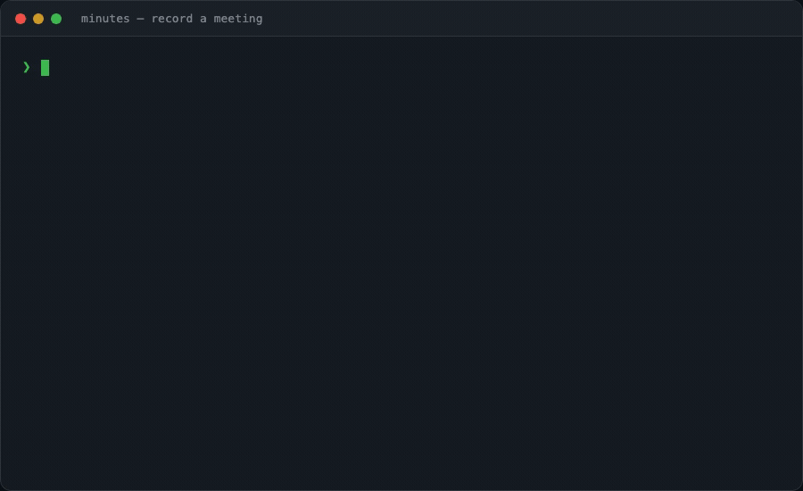

# minutes

[](https://github.com/silverstein/minutes)
[](LICENSE)
[](https://crates.io/crates/minutes-cli)

**Your AI remembers every conversation you've had.** &nbsp; [useminutes.dev](https://useminutes.dev)

Agents have run logs. Humans have conversations. **minutes** captures the human side — the decisions, the intent, the context that agents need but can't observe — and makes it queryable.

Record a meeting. Capture a voice memo on a walk. Ask Claude what was decided three weeks ago. It just works.

<p align="center">
  
</p>

### Works with

<p align="center">
  <a href="#any-mcp-client-claude-desktop-cursor-windsurf-your-own-agent">Claude Desktop</a> &bull;
  <a href="#claude-code-plugin">Claude Code</a> &bull;
  <a href="#any-mcp-client-claude-desktop-cursor-windsurf-your-own-agent">Cursor</a> &bull;
  <a href="#any-mcp-client-claude-desktop-cursor-windsurf-your-own-agent">Windsurf</a> &bull;
  <a href="#vault-sync-obsidian--logseq">Obsidian</a> &bull;
  <a href="#vault-sync-obsidian--logseq">Logseq</a> &bull;
  <a href="#iphone--mac-voice-memo-pipeline">iPhone Voice Memos</a> &bull;
  Any MCP client
</p>

## Quick start

```bash
# macOS — Desktop app (menu bar, recording UI, AI assistant)
brew install --cask silverstein/tap/minutes

# macOS — CLI only
brew tap silverstein/tap && brew install minutes

# Any platform — from source (requires Rust + cmake)
cargo install minutes-cli

# MCP server only — no Rust needed (Claude Desktop, Cursor, etc.)
npx minutes-mcp
```

```bash
minutes setup --model tiny    # Download whisper model (75MB)
minutes record                # Start recording
minutes stop                  # Stop and transcribe
```

## How it works

```
Audio → Transcribe → Summarize → Detect Attendees → Structured Markdown
         (local)       (LLM)      (calendar +          (decisions,
        whisper.cpp   Claude/      transcript)          action items,
                      Ollama/                           people, entities)
                      OpenAI
```

Everything runs locally. Your audio never leaves your machine (unless you opt into cloud LLM summarization). Attendees are automatically detected from macOS Calendar events and participant extraction from the transcript.

## Features

### Record meetings
```bash
minutes record                                    # Record from mic
minutes record --title "Standup" --context "Sprint 4 blockers"  # With context
minutes stop                                      # Stop from another terminal
```

### Take notes during meetings
```bash
minutes note "Alex wants monthly billing not annual billing"          # Timestamped, feeds into summary
minutes note "Logan agreed"                       # LLM weights your notes heavily
```

### Process voice memos
```bash
minutes process ~/Downloads/voice-memo.m4a        # Any audio format
minutes watch                                     # Auto-process new files in inbox
```

### Search everything
```bash
minutes search "pricing"                          # Full-text search
minutes search "onboarding" -t memo               # Filter by type
minutes actions                                   # Open action items across all meetings
minutes actions --assignee sarah                   # Filter by person
minutes list                                      # Recent recordings
```

### Cross-meeting intelligence
```bash
minutes research "pricing strategy"               # Search across all meetings
minutes person "Alex"                              # Build a profile from meeting history
minutes consistency                                # Flag contradicting decisions + stale commitments
```

### System diagnostics
```bash
minutes health                                   # Check model, mic, calendar, disk
minutes demo                                     # Run a demo recording (no mic needed)
```

## Switching from Granola?

Import your meeting history in one command:

```bash
minutes import granola --dry-run    # Preview what will be imported
minutes import granola              # Import all meetings to ~/meetings/
```

Reads from `~/.granola-archivist/output/`. Meetings are converted to Minutes' markdown format with YAML frontmatter. Duplicates are skipped automatically. All your data stays local — no cloud, no $18/mo.

## Output format

Meetings save as markdown with structured YAML frontmatter:

```yaml
---
title: Q2 Pricing Discussion with Alex
type: meeting
date: 2026-03-17T14:00:00
duration: 42m
context: "Discuss Q2 pricing, follow up on annual billing decision"
action_items:
  - assignee: mat
    task: Send pricing doc
    due: Friday
    status: open
  - assignee: sarah
    task: Review competitor grid
    due: March 21
    status: open
decisions:
  - text: Run pricing experiment at monthly billing with 10 advisors
    topic: pricing experiment
---

## Summary
- Alex proposed lowering API launch timeline from annual billing to monthly billing/mo
- Compromise: run experiment with 10 advisors at monthly billing

## Transcript
[SPEAKER_0 0:00] So let's talk about the pricing...
[SPEAKER_1 4:20] I think monthly billing makes more sense...
```

Works with [Obsidian](https://obsidian.md), grep, or any markdown tool. Action items and decisions are queryable via the CLI and MCP tools.

## iPhone → Mac voice memo pipeline

No iOS app needed. Use Apple's built-in Voice Memos + a Shortcut:

1. **Set up iCloud inbox** (one-time):
   ```bash
   mkdir -p ~/Library/Mobile\ Documents/com~apple~CloudDocs/minutes-inbox
   ```
2. **Add watch path** in `~/.config/minutes/config.toml`:
   ```toml
   [watch]
   paths = ["~/.minutes/inbox", "~/Library/Mobile Documents/com~apple~CloudDocs/minutes-inbox"]
   ```
3. **On iPhone**: Voice Memos → Share → Save to Files → iCloud Drive → `minutes-inbox`
4. **On Mac**: `minutes watch` picks it up, transcribes, saves to `~/meetings/memos/`

Supports `.m4a`, `.mp3`, `.wav`, `.ogg`, `.webm`. Format conversion is automatic via [symphonia](https://github.com/pdeljanov/Symphonia).

### Vault sync (Obsidian / Logseq)

```bash
minutes vault setup              # Auto-detect vaults, configure sync
minutes vault status             # Check health
minutes vault sync               # Copy existing meetings to vault
```

Three strategies: **symlink** (zero-copy), **copy** (works with iCloud/Obsidian Sync), **direct** (write to vault). `minutes vault setup` detects your vault and recommends the right strategy automatically.

## Claude integration

minutes is a native extension for the Claude ecosystem. **No API keys needed** — Claude summarizes your meetings when you ask, using your existing Claude subscription.

```
You: "Summarize my last meeting"
Claude: [calls get_meeting] → reads transcript → summarizes in conversation

You: "What did Alex say about pricing?"
Claude: [calls search_meetings] → finds matches → synthesizes answer

You: "Any open action items for me?"
Claude: [calls list_meetings] → scans frontmatter → reports open items
```

### Any MCP client (Claude Desktop, Cursor, Windsurf, your own agent)

Minutes exposes a standard MCP server. Point any MCP-compatible client at it:

```json
{
  "mcpServers": {
    "minutes": {
      "command": "npx",
      "args": ["minutes-mcp"]
    }
  }
}
```

**13 tools:** `start_recording`, `stop_recording`, `get_status`, `list_meetings`, `search_meetings`, `get_meeting`, `process_audio`, `add_note`, `consistency_report`, `get_person_profile`, `research_topic`, `qmd_collection_status`, `register_qmd_collection`

**6 resources:** `minutes://meetings/recent`, `minutes://status`, `minutes://actions/open`, `minutes://events/recent`, `minutes://meetings/{slug}`, `ui://minutes/dashboard`

**Interactive dashboard (Claude Desktop):** 5 tools render an inline interactive UI via [MCP Apps](https://modelcontextprotocol.io/specification/2025-03-26/server/utilities/apps) — meeting list with filter/search, detail view with fullscreen + "Send to Claude" context injection, person profiles, consistency reports. Text-only clients see the same data as plain text.

### Claude Code (Plugin)

Install the plugin directly from this repo:
```
/plugin marketplace add silverstein/minutes
/plugin install minutes@silverstein-minutes
```

11 skills, 1 agent, 2 hooks:
```
├── Core: /minutes record, search, list, note, verify, setup, cleanup
├── Interactive: /minutes prep, debrief, recap, weekly
├── Agent: meeting-analyst (cross-meeting intelligence)
└── Hooks: post-recording alerts + proactive meeting reminders
```

**Meeting lifecycle skills** — inspired by [gstack](https://github.com/garrytan/gstack)'s interactive skill pattern:

```
/minutes prep "call with Alex"     → relationship brief, talking points, .prep.md saved
  ↓
minutes record → minutes stop       → hook alerts if decisions conflict with prior meetings
  ↓
/minutes debrief                    → "You wanted to resolve pricing. Did you?"
  ↓
/minutes weekly                     → themes, decision arcs, stale items, Monday brief
```

### Minutes Desktop Assistant

The Tauri menu bar app includes a built-in AI Assistant window backed by the
same local meeting artifacts. It runs as a singleton assistant session:

- `AI Assistant` opens or focuses the persistent assistant window
- `Discuss with AI` reuses that same assistant and switches its active meeting focus

### Cowork / Dispatch
MCP tools are automatically available in Cowork. From your phone via Dispatch: *"Start recording"* → Mac captures → Claude processes → summary on your phone.

### Optional: automated summarization

```toml
# Use your existing Claude Code or Codex subscription (recommended)
[summarization]
engine = "agent"
agent_command = "claude"  # or "codex" for OpenAI Codex users

# Or use a free local LLM
[summarization]
engine = "ollama"
ollama_model = "llama3.2"
```

## Install

### macOS

```bash
# Desktop app (menu bar, recording UI, AI assistant)
brew install --cask silverstein/tap/minutes

# CLI only (terminal recording, search, vault sync)
brew tap silverstein/tap
brew install minutes

# Or from source (requires Rust + cmake)
export CXXFLAGS="-I$(xcrun --show-sdk-path)/usr/include/c++/v1"
cargo install --path crates/cli
```

### Windows

```powershell
# Download pre-built binary from GitHub releases, or build from source:
# Requires: Rust, cmake, MSVC build tools
cargo install --path crates/cli
```

### Linux

```bash
# Requires: Rust, cmake, ALSA dev headers
sudo apt-get install -y libasound2-dev  # Debian/Ubuntu
cargo install --path crates/cli
```

### Setup (all platforms)

```bash
# Download whisper model
minutes setup --model tiny    # Quick start (75MB, fast, less accurate)
minutes setup --model small   # Recommended (466MB, good accuracy)
minutes setup --model base    # Middle ground (141MB)
```

> **Platform notes:** Calendar integration (auto-detecting meeting attendees) requires macOS. Screen context capture works on macOS and Linux. All other features — recording, transcription, search, action items, person profiles — work on all platforms.

### Desktop app

```bash
# Homebrew cask (recommended)
brew install --cask silverstein/tap/minutes

# Or build from source
export CXXFLAGS="-I$(xcrun --show-sdk-path)/usr/include/c++/v1"
export MACOSX_DEPLOYMENT_TARGET=11.0
cargo tauri build --bundles app
```

The desktop app adds a system tray icon, recording controls, audio visualizer, and a meeting list window. macOS will prompt for microphone permission on first recording.

**Privacy:** All Minutes windows are hidden from screen sharing by default — other participants on Zoom/Meet/Teams won't see the app. Toggle via the tray menu: "Hide from Screen Share ✓".

### Troubleshooting

**No speech detected / blank audio:**
The most common cause is microphone permissions. Check System Settings → Privacy & Security → Microphone and ensure your terminal app (or Minutes.app) has access.

**tmux users:** tmux server runs as a separate process that doesn't inherit your terminal's mic permission. Either run `minutes record` from a direct terminal window (not inside tmux), or use the Minutes.app desktop bundle which gets its own mic permission.

**Build fails with C++ errors on macOS 26+:**
whisper.cpp needs the SDK include path. Set `CXXFLAGS` as shown above before building.

## Configuration

Optional — minutes works out of the box.

```toml
# ~/.config/minutes/config.toml

[transcription]
model = "small"           # tiny (75MB), base, small (466MB), medium, large-v3 (3.1GB)

[summarization]
engine = "none"           # Default: Claude summarizes conversationally via MCP
                          # "agent" = uses your Claude Code or Codex subscription (no API key)
                          # "ollama" = local, free
                          # "claude" / "openai" = direct API key (legacy)
agent_command = "claude"  # Which CLI to use when engine = "agent" (claude, codex, etc.)
ollama_url = "http://localhost:11434"
ollama_model = "llama3.2"

[diarization]
engine = "none"           # "none" (default) or "pyannote" (requires pip install pyannote.audio + HuggingFace auth)

[search]
engine = "builtin"        # builtin (regex) or qmd (semantic)

[watch]
paths = ["~/.minutes/inbox"]
settle_delay_ms = 2000    # iCloud sync safety delay

[screen_context]
enabled = false           # Opt-in: capture screenshots during recording for LLM context
interval_secs = 30        # How often to capture (seconds)
keep_after_summary = false # Delete screenshots after summarization (default: clean up)

[assistant]
agent = "claude"          # CLI launched by the Tauri AI Assistant
agent_args = []           # Optional extra args, e.g. ["--dangerously-skip-permissions"]
```

## Architecture

```
minutes/
├── crates/core/    17 Rust modules — the engine (shared by all interfaces)
├── crates/cli/     CLI binary — 15 commands
├── crates/reader/  Lightweight read-only meeting parser (no audio deps)
├── crates/mcp/     MCP server — 13 tools + 6 resources + interactive dashboard
│   └── ui/         MCP App dashboard (vanilla TS → single-file HTML)
├── tauri/          Menu bar app — system tray, recording UI, singleton AI Assistant
└── .claude/plugins/minutes/   Claude Code plugin — 11 skills + 1 agent + 2 hooks
```

Single `minutes-core` library shared by CLI, MCP server, and Tauri app. Zero code duplication.

### Building your own agent on Minutes

Minutes is designed as infrastructure for AI agents. The MCP server is the primary integration surface:

- **Read meetings**: `list_meetings`, `search_meetings`, `get_meeting` return structured JSON
- **Track people**: `get_person_profile` builds cross-meeting profiles with topics, open commitments
- **Monitor consistency**: `consistency_report` flags conflicting decisions and stale commitments
- **Record + process**: `start_recording`, `stop_recording`, `process_audio` for pipeline control
- **Resources**: Stable URIs (`minutes://meetings/recent`, `minutes://actions/open`) for agent context injection

Any agent framework that speaks MCP can use Minutes as its conversation memory layer — the agent handles the intelligence, Minutes handles the recall.

**Built with:** Rust, [whisper.cpp](https://github.com/ggerganov/whisper.cpp), [symphonia](https://github.com/pdeljanov/Symphonia), [cpal](https://github.com/RustAudio/cpal), [Tauri v2](https://v2.tauri.app/), [ureq](https://github.com/algesten/ureq)

## Star History

[](https://star-history.com/#silverstein/minutes&Date)

## Contributing

See [CONTRIBUTING.md](CONTRIBUTING.md).

## License

MIT
